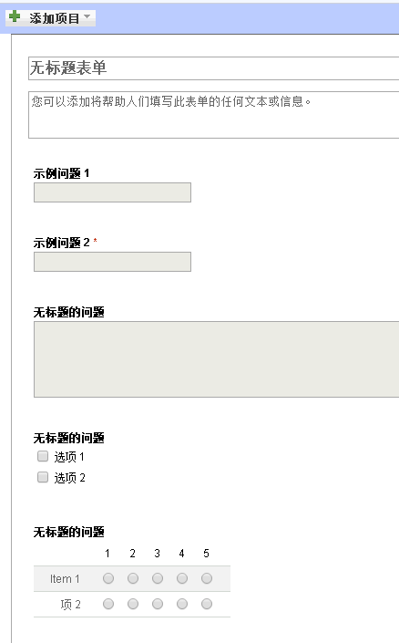
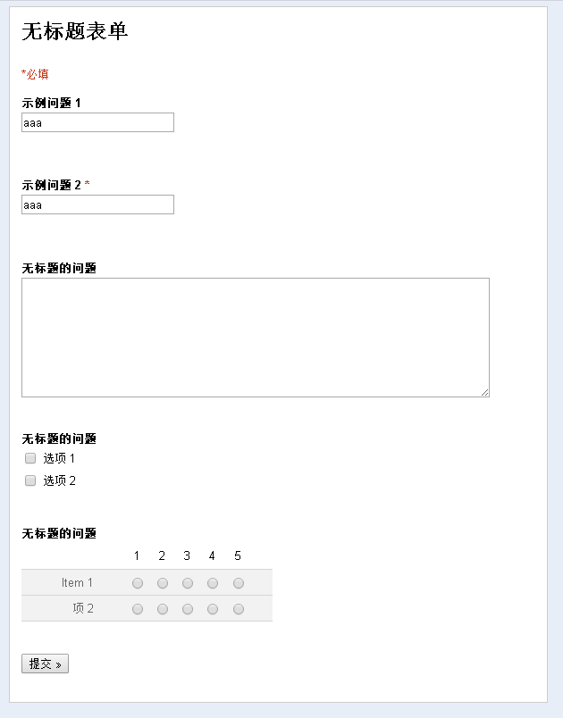
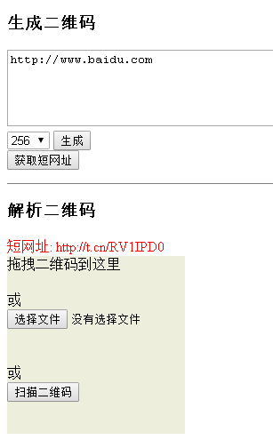
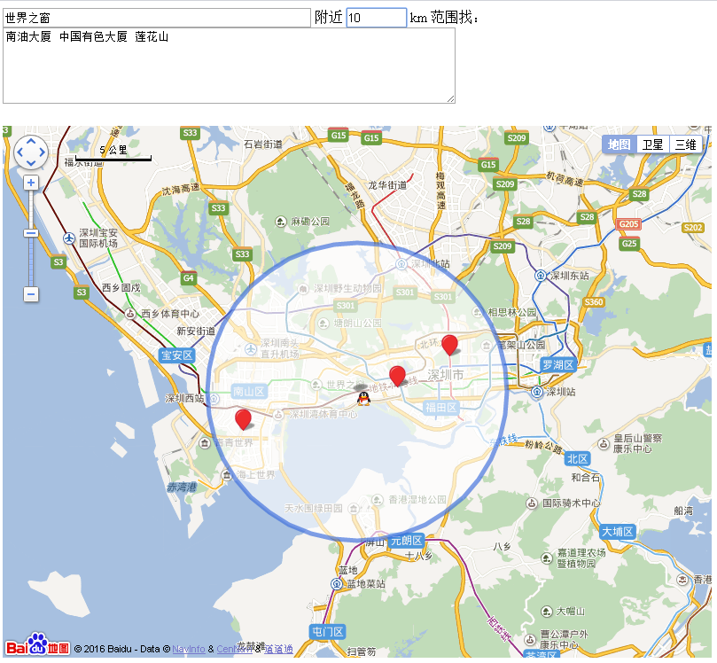
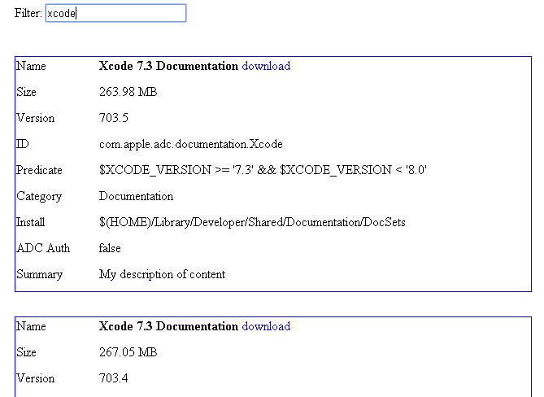

# 激发云力量--打造我的云端工具集
------
<!-- TOC depthFrom:1 depthTo:2 updateOnSave:true -->

- [激发云力量--打造我的云端工具集](#%E6%BF%80%E5%8F%91%E4%BA%91%E5%8A%9B%E9%87%8F--%E6%89%93%E9%80%A0%E6%88%91%E7%9A%84%E4%BA%91%E7%AB%AF%E5%B7%A5%E5%85%B7%E9%9B%86)
    - [0.前言](#0%E5%89%8D%E8%A8%80)
    - [1.环境搭建(php)](#1%E7%8E%AF%E5%A2%83%E6%90%AD%E5%BB%BAphp)
    - [2.问卷系统](#2%E9%97%AE%E5%8D%B7%E7%B3%BB%E7%BB%9F)
    - [3.二维码工具](#3%E4%BA%8C%E7%BB%B4%E7%A0%81%E5%B7%A5%E5%85%B7)
    - [4.地图搜索](#4%E5%9C%B0%E5%9B%BE%E6%90%9C%E7%B4%A2)
    - [5.XCode dmg / docset下载地址获取](#5xcode-dmg--docset%E4%B8%8B%E8%BD%BD%E5%9C%B0%E5%9D%80%E8%8E%B7%E5%8F%96)

<!-- /TOC -->
## 0.前言
> 日常工作中，有很多小需求，作为码农，总喜欢自己动手做点小东西出来，也成为学习与实践的好机会。
在使用**腾讯云**过程中，从环境搭建、各个小需求的构思，前后端技术的琢磨、学习、使用，收获很大。
现在整理出来和大家分享。

先说说做了哪些事情（都来源于实际小需求）：
> * [问卷系统](http://t.ydjiao.com/eform "问卷系统")：借鉴Google表单，支持文本、单选、多选、分页以及问卷的复制、导出
> * [二维码工具集](http://t.ydjiao.com/qr "二维码工具集")：支持生成二维码、解析/扫描二维码，**微信加群短网址生成**
> * [地图搜索](http://t.ydjiao.com/map "地图搜索")：按中心搜索周边多个位置
> * [XCode dmg / docset下载地址获取](http://t.ydjiao.com/xcode "XCode dmg / docset下载地址获取")

其他用途
> * 个人博客
> * 运行[phantomjs](http://phantomjs.org/ "phantomjs")，在服务器上跑浏览器去模拟访问页面、截图、自动化测试
> * 架设[Charles Proxy](https://www.charlesproxy.com/documentation/installation/apt-repository/ "Charles Proxy")，不用单独开wifi ap，比Fiddler更简单的抓包
> * 物联时代，和你的智能设备联动起来：[魔豆路由器-云消息](http://bbs.modouwifi.cn/thread-7223-1-1.html "魔豆路由器-云消息")
> * [抓豆瓣妹子](https://www.v2ex.com/t/141476 "抓豆瓣妹子") 


## 1.环境搭建(php)
使用了**腾讯云**￥65/月 的 ubuntu 14 x64，经济实惠，适合投入有限的程序猿猿。

我的云端工具集都是基于后端php、前端h5实现。php可以和apache或nginx配套使用。
> 配置好的同学可以跳过
> 网络上资料很多，也可以根据自己的系统、喜欢的方式来配置、搭建环境
> 例如CentOS参考这里：http://blog.sina.com.cn/s/blog_505bf9af010137gf.html

apache2+php+mysql安装非常简单：
```
sudo apt-get update
sudo apt-get install apache2 php5
service apache2 start
```
然而更喜欢 nginx + php 的组合：
```
# 安装最新的nginx，模块、功能全。参考：http://nginx.org/en/linux_packages.html#stable
#  加入nginx官方key
wget http://nginx.org/keys/nginx_signing.key
sudo apt-key add nginx_signing.key
rm nginx_signing.key
#  加入nginx官方源
codename=$(lsb_release -a|grep Codename|awk '{print $2}')
echo deb http://nginx.org/packages/ubuntu/ $codename nginx > nginx.list
echo deb-src http://nginx.org/packages/ubuntu/ $codename nginx >> nginx.list
sudo cp nginx.list /etc/apt/sources.list.d/nginx.list
#  开始安装，默认已经开启，没开就service nginx start开启下
sudo apt-get update
sudo apt-get install nginx
#  看看安装好了没，默认80已经开啦
netstat -tln
#  如果无法访问，可以看看安全组有没有加上80： https://console.qcloud.com/cvm/securitygroup


# 安装php和常用库。也是默认就已经开启啦，没有就运行service php5-fpm开启
sudo apt-get install php5-common php5-fpm php5-cli php5-curl php5-gd php5-sqlite php5-mcrypt

# nginx使用用户“nginx”运行，php5-fpm使用“www-data”运行
# nginx无权限访问php5-fpm的sock来通信的
# 所以加个组，就有权限啦
sudo usermod -a -G www-data -G nginx  nginx

```
修改sudo vim /etc/nginx/conf.d/default.conf (假定代码放到/home/ubuntu/www目录)
```
server {
    listen       80;
    server_name  localhost;
    root /home/ubuntu/www;
    index   index.php index.html index.htm;
    error_page   500 502 503 504  /50x.html;
    location = /50x.html {
        root /home/ubuntu/www;
    }
    location ~ \.php$ {
         try_files      $uri = 404;
         fastcgi_split_path_info ^(.+\.php)(/.+)$;
         fastcgi_pass   unix:/var/run/php5-fpm.sock;
         fastcgi_index  index.php;
         include        fastcgi_params;
         fastcgi_param  SCRIPT_FILENAME  $document_root$fastcgi_script_name;
    }
}
```
可选：允许 `<?php` 简化为 `<?`
```
sed -i 's/short_open_tag = Off/short_open_tag = On/g' /etc/php5/fpm/php.ini
```
重新启动nginx、php5-fpm
```
sudo service php5-fpm restart
sudo service nginx restart
```
写个demo页面访问`http://server ip/`看看
```
echo "<? phpinfo(); ?>" > /home/ubuntu/www/index.php
```
## 2.问卷系统
### 背景
Google Docs的表单功能很棒，支持很多种类型：文本框、单选、多选、下拉框、网格，分页等，然而在墙内不可用。
在腾讯问卷http://wj.qq.com/出来前，试过很多其他问卷系统，搭建复杂；第三方的问卷系统也不是那么好用，于是早先自己写了套，也是一个学习的过程。
（老早写的代码，风格、组织不太好，就不开源了^_^，有需要的可以拿去看看）
> 在很长一段时间里，大家中午一起订外卖。一直用这个东西来收集大家菜单，轮流担任外卖PM，负责下单、拿外卖。

**前端**：从Google表单分离了前端js代码，略作调整
**后台**：php来收集表单元素的json，存储；组装问卷页面；问卷回答的存储和下载

### 实现思路
> * step1：前端使用js，添加各类表单元素元素，记录对应数据。其中EntryType表示是文本、单选、网格等类型，Choices字段记录对应选项。

```
    {
      "EntryId": 3,
      "Composite": false,
      "QuestionTitle": "无标题的问题",
      "HelpText": "",
      "EntryType": 4,
      "Choices": [
        {
          "SelectedByDefault": false,
          "Value": "选项 1",
          "Label": "",
          "GoToPage": -2
        },
        {
          "SelectedByDefault": false,
          "Value": "选项 2",
          "Label": "",
          "GoToPage": -2
        }
      ],
      "OtherOptionEnabled": false,
      "Required": false,
      "GoToPageEnabled": false,
      "Position": 3
    }
```
> * step2：点“保存”按钮，以json格式，post整个表单数据，后台php存储下来，使用随机id标识。（目前以文件方式，没有使用db）。
> * step3：打开问卷时，使用id读取到对应问卷的json配置，根据EntryType生成html代码，返回给前端
> * step4：问卷回答后，以k=v&x=y提交，后台按题目顺序，将答案整理为csv，存储到文件
> * step5：为问卷生成了特殊的链接，可以查看、下载数据，把csv发给前端即可。

### 看看效果
创建表单



填写表单



### 可以改进的地方
当时是一只菜鸟，很多代码偏于实现，现在看来
> * 代码结构很乱，可以优化。
> * 表单元素的渲染采用了纯html的拼接，如果在后端使用tinybutstrong/前端使用art-template或angular.js/react/vue.js这类MVVM框架，可以更优雅的完成。

## 3.二维码工具
### 背景
经常有需要生成二维码，但：
> * 第三方二维码生成页面都会有很多其他元素，不喜欢
> * 不能保证第三方会不会收集、存储你输入的文本信息，例如网址、电话号码、wifi密码
> * 就想做一个自己玩

### 生成二维码
html5中，调用这个js即可
> http://jeromeetienne.github.io/jquery-qrcode/

```
<script src="https://ajax.googleapis.com/ajax/libs/jquery/1.5.2/jquery.min.js"></script>
<script type="text/javascript" src="http://jeromeetienne.github.io/jquery-qrcode/src/jquery.qrcode.js"></script>
<div id="qrcode"></div>
```
```
$('#qrcode').qrcode({
  width: 64,
  height: 64,
  text: 'hello, world'
});
```
但是jquery-qrcode生成的二维码在table或canvas中，**无法右击保存**
所以改造下，渲染成能右击-另存为的< img >标签
```

```
```
function make_qrcode(text, width) {
  width = width || 256;
  var div = $('<div></div>');//生成到这个虚拟的dom
  div.qrcode({
    width: width,
    height: width,
    text: text
  });
  // 获取实际DataUrl，给真实的img元素
  // 这个img就可以右击-另存为啦
  var url = div.find('canvas')[0].toDataURL();
  $('#qr_img').attr('src', url);
}

make_qrcode(256, 'hello, world')
```
### 突然来的一个需求
不是产品经理提的，自己挖掘的
玩手机游戏，家族里，大家想加个微信群：
> * 族长告诉大家自己的微信号，然后大家加
> * 族长把群二维码发给加她的人

好麻烦，如果能聊天中发二维码多简单。。。
> * 微信群中，群二维码，保存到手机
> * 上传这个二维码，假如结果为xxx
> * 生成一个短网址t.cn/abcd，发到游戏聊天会话中
> * 家族的小伙伴们 复制或手动打开，跳到一个页面，这个页面出现一个二维码，用微信扫描后加群

以后，族长只要**上传群二维码**，然后**生成短网址**，把网址发给大家，小伙伴们就可以愉快的加群啦

### 实现
二维码解析用这个js库
> * https://github.com/LazarSoft/jsqrcode

```
// 从input[type=file]或drop获得的file中解析二维码
var reader = new FileReader();
reader.onload = function(e) {
  qrcode.decode(e.target.result);
};
reader.readAsDataURL(file);

// navigator.getUserMedia开启摄像头扫描二维码
// 代码60多行，可以直接看http://t.ydjiao.com/qr/index.js，核心部分start_scan
// 定时采集video到canvas，然后调用qrcode.decode尝试解析canvas
```

**以上二维码生成、解析都是纯js、前端完成**
短网址只能依赖后台做转换了，写个php调用api.t.sina.com.cn的api就好
### 效果
> * **手机、PC都可用** http://t.ydjiao.com/qr
> * 二维码生成、解析、扫描



## 4.地图搜索
### 背景
> * 知道公司班车几条线路所有停靠站点，先看看家附近哪里可以乘坐
> * 最好能在地图直观看到 家、所有站点位置

### 思路
> * 调用百度地图api，把所有地址转换成经纬度，在地图上标记出来

### 实现
这个比较简单，做下用户输入的查询的解析，发请求给百度地图api
但是确实做了些交互体验的东西，输入立刻查询、已查询地点缓存等

```
var city = '深圳';
var geocoder = new BMap.Geocoder();
var geolocation = new BMap.Geolocation();
var map = new BMap.Map('container');

geocoder.getPoint(city, function(point) {
  console.info('point:', point);
  map.centerAndZoom(point, 11);
  map.addControl(new BMap.MapTypeControl());
  map.addControl(new BMap.NavigationControl());
  map.addControl(new BMap.ScaleControl({anchor: BMAP_ANCHOR_TOP_LEFT}));
  ...
  // 更多代码可以直接打开http://t.ydjiao.com/map，右击，查看网页源代码
});
```



## 5.XCode dmg / docset下载地址获取
### 背景
> * 从Mac上的App Store下载XCode太慢，而且无法和同事分享安装包
> * 相关文档docset只能从XCode里面下载，太慢，也不方便分享
> * 第三方下载**安全风险大** [XCodeGhost安全事件](https://security.tencent.com/index.php/blog/msg/96)

### 思路
> * 抓取XCode更新过程中，从Apple获取的下载地址，用工具下载

### 实现
跑起XCode，抓包看看，发现访问了https://developer.apple.com/library/downloads/docset-index.dvtdownloadableindex
打开看看，大礼包都在
> 这个文件是apple加的CFProperty，找了个php版本的解析工具CFPropertyList

```
$url = 'https://developer.apple.com/library/downloads/docset-index.dvtdownloadableindex';
$xml = file_get_contents($url);
$plist = new CFPropertyList\CFPropertyList();
$plist->parse($xml);
$docs = $plist->toArray();
// 然后按友好的格式输出就行啦
```

### 效果
