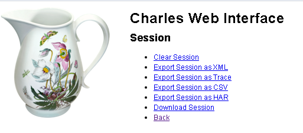

# 云端“Fiddler”抓包
------
Fiddler很好用，但对手机或网络外其他设备抓包时，操作、配置就复杂了。
一般通过接入同一网络或架设ap热点来抓包。

而利用云服务，在云端架设代理，只要能够访问公网，就能抓包啦
本文基于charles抓包，讲抓包内容导出har，然后在本地用fiddler或charles分析。

> * 安装jdk
```
sudo add-apt-repository ppa:webupd8team/Java
sudo apt-get update
sudo apt-get install Oracle-java8-installer
```
> * 安装charles
```
wget -q -O - https://www.charlesproxy.com/packages/apt/PublicKey | sudo apt-key add -
sudo sh -c 'echo deb https://www.charlesproxy.com/packages/apt/ charles-proxy main > /etc/apt/sources.list.d/charles.list'
sudo apt-get update
sudo apt-get install charles-proxy
```
> * 启动charles
```
charles
```
为了能够方便的导出会话，可以开启charles 的 web 界面，设置管理用的用户名、密码
在本地charles中开启web interface，然后将`%AppData%\Charles\charles.config`拷贝到服务器
重新开启charles
```
charles -config charles.config
```
在本地设置使用http代理：server 8888
打开`http://control.charles/`就可以看到管理界面啦

